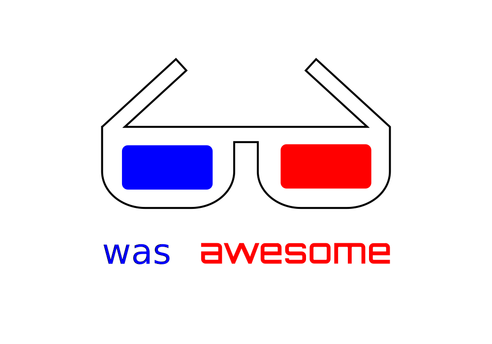

	

	<a href="awesome.md">What is an awesome list?</a>&nbsp;&nbsp;&nbsp;
	<a href="contributing.md">Contribution guide</a>&nbsp;&nbsp;&nbsp;
	<a href="create-list.md">Creating a list</a>&nbsp;&nbsp;&nbsp;
	<a href="https://twitter.com/awesome__re">Twitter</a>&nbsp;&nbsp;&nbsp;

 

	<b>Follow the <a href="https://twitter.com/awesome__re">Awesome Twitter account</a> for updates on new list additions.</b>

 

	Just type <a href="https://awesome.re"><code>awesome.re</code></a> to go here. Check out my <a href="https://blog.sindresorhus.com">blog</a> and follow me on <a href="https://twitter.com/sindresorhus">Twitter</a>.

 

## Contents

- [Design Software](#design-software)
- [JavaScript Frameworks](#javascript-frameworks)

## Design Software

- [Macromedia Fireworks](https://en.wikipedia.org/wiki/Adobe_Fireworks) - The first good design tool built for the web (that slicing tho!)

## JavaScript Frameworks

Note: A lot of these frameworks are still being developed today. They might still be awesome, but [they used to too](https://www.youtube.com/watch?v=ndBjraV-3UY), and at the time they were _the_ tools.

- [MooTools](https://mootools.net/) - A collection of JS utilities that was originally released as an extension of PrototypeJS. There may have been other ways of doing DOM effects/transitions < 2010, but...MooTools...
- [Prototype](http://prototypejs.org/) - Extended native JS objects to take (some of) the pain out of browser development. Originally released in 2005 as part of the foundation for Ajax support in Ruby on Rails ([source](https://en.wikipedia.org/wiki/Prototype_JavaScript_Framework)).

## License

To the extent possible under law, [Mux](https://mux.com) has waived all copyright and related or neighboring rights to this work.
